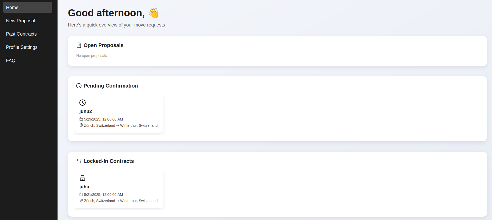
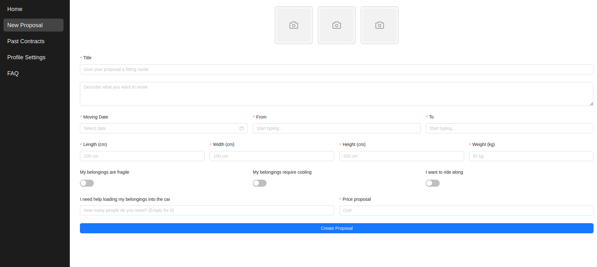
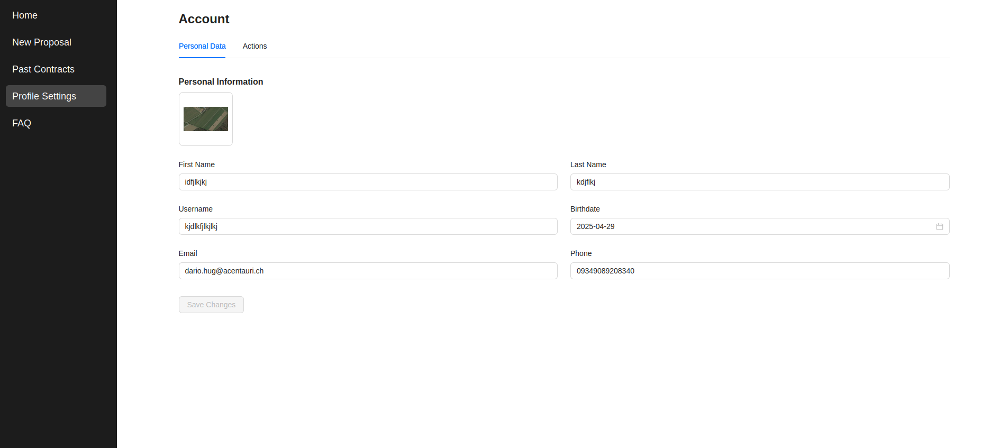
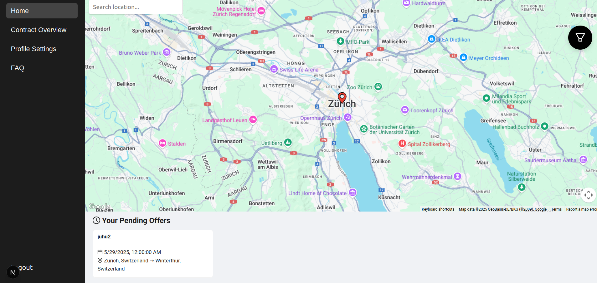
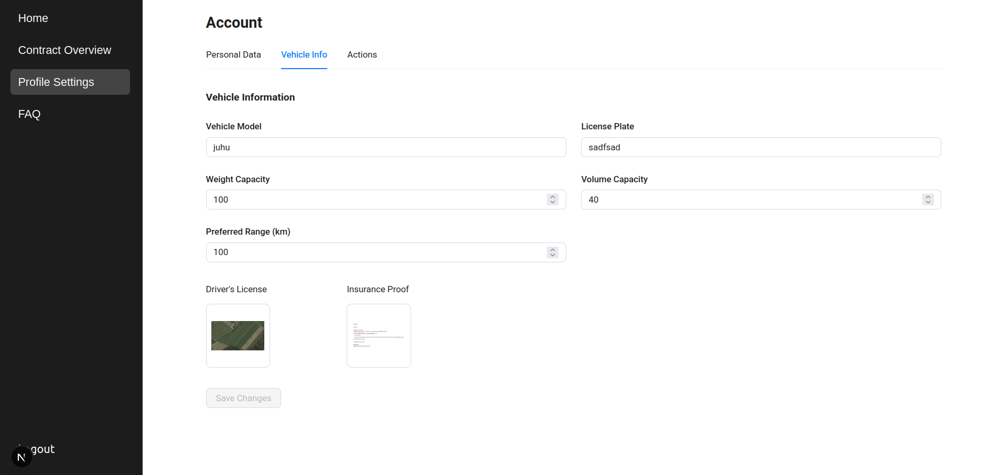
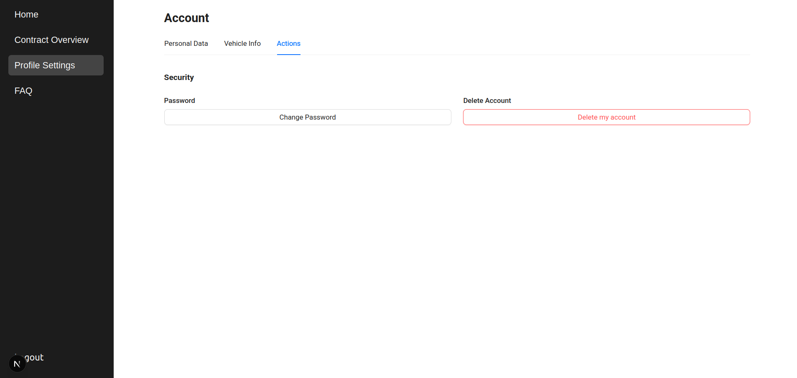

# Getting Started

### MacOS, Linux and WSL

If you are using MacOS, Linux or WSL(Windows-Subsystem-Linux), you can skip
directly to the
[installation part](https://github.com/HASEL-UZH/sopra-fs25-template-client?tab=readme-ov-file#installation)

### Windows

If you are using Windows, you first need to install
WSL(Windows-Subsystem-Linux). You might need to reboot your computer for the
installation, therefore, save and close all your other work and programs

1. Download the following [powershell script](./windows.ps1)\
   

---
2. Open a new powershell terminal **with admin privileges** and run the following command and follow the instructions. Make sure that you open the powershell terminal at the path where you have downloaded the powershell script, otherwise the command will not work because it can not find the script. You can list currently accessible files in the powershell terminal with ```dir``` and you can use ```cd``` to navigate between directories
   ```shell
   C:\Windows\System32\WindowsPowerShell\v1.0\powershell.exe -ExecutionPolicy Bypass -File .\windows.ps1
   ```
---

3. If you experience any issues, try re-running the script a couple of times. If
   the installation remains unsuccessful, follow this
   [youtube tutorial](https://youtu.be/GIYOoMDfmkM) or post your question in the
   OLAT forum

---
4. After successful installation, you can open WSL/Ubuntu. You will need to choose a username and password, although no characters will be shown on the screen when typing the password but the system recognizes your input, no worries :) After these four steps your setup should look similar to this

<br>
<br>
<br>
# Installation
1. Open a new MacOS, Linux or WSL(Windows-Subsystem-Linux) terminal. Make sure you have git installed, you can check that by running
   ```shell
   git --version
   ```
   The output should be something similar to ```git version X.XX.X```, if not, try to install git in one of the following ways
   #### MacOS
   ```shell
   brew install --formulae git
   ```
   #### Linux/WSL
   ```shell
   sudo apt-get install git
   ```
   If you are not using Ubuntu, you will need to install git with your package manager of choice
---

2. Clone the repository with git using the following command
   ```shell
   git clone https://github.com/YOUR_USERNAME/YOUR-CLIENT-REPO
   ```

---
3. Navigate to the cloned directory in the terminal, in example with ```cd sopra-fs25-student-client```
---

4. Inside the repository folder (with `ls` you can list files) there is a bash
   script _setup.sh_ that will install everything you need, according to the
   system you are using. Run the following command and follow the instructions
   ```shell
   source setup.sh
   ```

The screenshot below shows an example of how this looks


The installation script _setup.sh_ can take a few minutes, please be patient and
do not abort the process. If you encounter any issues, please close the terminal
and open a new one and try to run the command again

<br>
<br>
<br>

# Troubleshooting the installation

If the four steps above did not work for you and re-running the setup.sh script
a couple of times did not help, try running the following steps manually

1. Open a new MacOS, Linux or WSL(Windows-Subsystem-Linux) terminal and navigate
   to the repository with `cd`. Then ensure that curl is installed
   ```shell
   curl --version
   ```
   The output should be something similar to `curl X.X.X`, if not, try to
   install curl in one of the following ways
   #### MacOS
   ```shell
   brew install --formulae curl
   ```
   #### Linux/WSL
   ```shell
   sudo apt-get install curl
   ```
   If you are not using Ubuntu, you will need to install curl with your package
   manager of choice

---
2. Download Determinate Nix
   ```shell
   curl --proto '=https' --tlsv1.2 -ssf --progress-bar -L https://install.determinate.systems/nix -o install-nix.sh
   ```
---

3. Install Determinate Nix
   ```shell
   sh install-nix.sh install --determinate --no-confirm --verbose
   ```

---
4. Install direnv using nix
   ```shell
   nix profile install nixpkgs#direnv
   ```
   If you encounter a permission error, try running with sudo
   ```shell
   sudo nix profile install nixpkgs#direnv
   ```
---

5. Find out what shell you are using
   ```shell
   echo $SHELL
   ```

---
6. Hook direnv into your shell according to [this guide](https://github.com/direnv/direnv/blob/master/docs/hook.md)
---

7. Allow direnv to access the repository
   ```shell
   direnv allow
   ```

If all troubleshooting steps above still did not work for you, try the following
as a **last resort**: Open a new terminal and navigate to the client repository
with `cd`. Run the command. Close the terminal again and do this for each of the
six commands above, running each one in its own terminal, one after the other.

<br>
<br>
<br>

# Available commands after successful installation

With the installation steps above your system now has all necessary tools for
developing and running the sopra frontend application. Amongst others, two
javascript runtimes have been installed for running the app:

- [NodeJS](https://nodejs.org)
- [Deno](https://deno.com)

Runtimes is what your system needs to compile
[typescript](https://www.typescriptlang.org) code (used in this project) to
javascript and execute the application. You can use either runtime for this
project, according to your preference. Both come with an included package
manager, `npm` for nodejs and `deno` for deno. Thereby, the
[package.json](./package.json) file defines possible commands that can be
executed (using either `deno` or `npm`). The following commands are available in
this repository:

1. **Running the development server** - This will start the application in
   development mode, meaning that changes to the code are instantly visible live
   on [http://localhost:3000](http://localhost:3000) in the browser
   ```bash
   deno task dev
   ```
2. **Building a production-ready application** - This will create an optimized
   production build that is faster and takes up less space. It is a static
   build, meaning that changes to the code will only be included when the
   command is run again
   ```bash
   deno task build
   ```
3. **Running the production application** - This will start the optimized
   production build and display it on
   [http://localhost:3000](http://localhost:3000) in the browser. This command
   can only be run _after_ a production build has been created with the command
   above and will not preview live code changes
   ```bash
   deno task start
   ```
4. **Linting the entire codebase** - This command allows to check the entire
   codebase for mistakes, errors and warnings
   ```bash
   deno task lint
   ```
5. **Formatting the entire codebase** - This command will ensure that proper
   indentation, spacing and further styling is applied to the code. This ensures
   that the code looks uniform and the same across your team members, it is best
   to run this command _every time before pushing changes to your repository_!
   ```bash
   deno task fmt
   ```

All of the above mentioned commands can also be run using the nodejs runtime by
substituting `deno task` with `npm run`, i.e

```bash
npm run dev
```

<br>
<br>
<br>

# Docker

### Introduction

Docker is a tool that uses containers as isolated environments, ensuring that
the application runs consistently and uniformly across different devices.\
Everything in this repository is already set up to minimize your effort for
deployment.\
All changes to the main branch will automatically be pushed to dockerhub and
optimized for production.

### Setup

1. **One** member of the team should create an account on
   [dockerhub](https://hub.docker.com/), _incorporating the group number into
   the account name_, for example, `SoPra_group_XX`.\
2. This account then creates a repository on dockerhub with the _same name as
   the group's Github repository name_.\
3. Finally, the person's account details need to be added as
   [secrets](https://docs.github.com/en/actions/security-guides/using-secrets-in-github-actions#creating-secrets-for-a-repository)
   to the group's repository:
   - dockerhub_username (the username of the dockerhub account from step 1, for
     example, `SoPra_group_XX`)
   - dockerhub_password (a generated
     PAT([personal access token](https://docs.docker.com/docker-hub/access-tokens/))
     of the account with read and write access)
   - dockerhub_repo_name (the name of the dockerhub repository from step 2)

### Pull and run

Once the image is created and has been successfully pushed to dockerhub, the
image can be run on any machine.\
Ensure that [Docker](https://www.docker.com/) is installed on the machine you
wish to run the container.\
First, pull (download) the image with the following command, replacing your
username and repository name accordingly.

`docker pull <dockerhub_username>/<dockerhub_repo_name>`

Then, run the image in a container with the following command, again replacing
_<dockerhub_username>_ and _<dockerhub_repo_name>_ accordingly.

`docker run -p 3000:3000 <dockerhub_username>/<dockerhub_repo_name>`

<br>
<br>
<br>

# Installing additional software by modifying [flake.nix](./flake.nix)

As this project uses Determinate Nix for managing development software,
installing additional tools you might need is straightforward. You only need to
adjust the section `nativeBuildInputs = with pkgs;` in the
[nix flake](./flake.nix) with the package you would like to install. For
example, if you want to use docker (the [Dockerfile](./Dockerfile) and
[.dockerignore](./.dockerignore) are already included in this repo) you can
simply add:

```nix
nativeBuildInputs = with pkgs;
  [
    nodejs
    git
    deno
    watchman
    docker ### <- added docker here
  ]
  ++ lib.optionals stdenv.isDarwin [
    xcodes
  ]
  ++ lib.optionals (system == "aarch64-linux") [
    qemu
  ];
```

and add the package path to the `shellHook''` section

```nix
        devShells.default = pkgs.mkShell {
          inherit nativeBuildInputs;

          shellHook = ''
            export HOST_PROJECT_PATH="$(pwd)"
            export COMPOSE_PROJECT_NAME=sopra-fs25-template-client
            
            export PATH="${pkgs.nodejs}/bin:$PATH"
            export PATH="${pkgs.git}/bin:$PATH"
            export PATH="${pkgs.deno}/bin:$PATH"
            export PATH="${pkgs.watchman}/bin:$PATH"
            export PATH="${pkgs.docker}/bin:$PATH" ### <- added docker path here
            
            ### rest of code ###
        };
```

and finally do `direnv reload` in your terminal inside the repository folder. If
you need a specific version of a package, you can override it in the `overlays`
section

```nix
overlays = [
  (self: super: {
    nodejs = super.nodejs_23; ### <- changed to nodejs 23
  })
];
```

<br>
<br>
<br>

# Miscellaneous

This project uses
[`next/font`](https://nextjs.org/docs/app/building-your-application/optimizing/fonts)
to automatically optimize and load [Geist](https://vercel.com/font), a new font
family for Vercel.

## Learn More

To learn more about Next.js, take a look at the following resources:

- [Next.js Documentation](https://nextjs.org/docs) - learn about Next.js
  features and API.
- [Learn Next.js](https://nextjs.org/learn) - an interactive Next.js tutorial.

You can check out
[the Next.js GitHub repository](https://github.com/vercel/next.js) - your
feedback and contributions are welcome!

## Deploy on Vercel

The easiest way to deploy your Next.js app is to use the
[Vercel Platform](https://vercel.com/new?utm_medium=default-template&filter=next.js&utm_source=create-next-app&utm_campaign=create-next-app-readme)
from the creators of Next.js.

Check out our
[Next.js deployment documentation](https://nextjs.org/docs/app/building-your-application/deploying)
for more details.

## Windows users

Please ensure that the repository folder is inside the WSL2 filesystem
(otherwise, the disk IO performance will be horrible). If you followed the
tutorial closely, this is already the case. If for whatever reason you deviated
from the instructions, please take the time now to ensure the repo is on the WSL
filesystem. You can do this either by

1. _Cloning the repository again with git in a WSL/Ubuntu terminal using the
   following command and deleting the repository on the windows filesystem_
   ```shell
   git clone https://github.com/HASEL-UZH/sopra-fs25-template-client
   ```
2. _Using the Windows explorer to move the repository from the windows
   filesystem to WSL filesystem_ In the left overview of all folders and drives
   there should be a new filesystem called Linux (also check in the network
   tab). Open the Linux drive and open the folder named "home", followed by your
   username. Copy the whole repository folder from your current location to the
   Linux folder /home/your-username (note that the folder will initially be
   empty). Finally, delete the folder from your current location such that you
   only have the folder inside the Linux filesystem.
3. _Using the command line in WSL to move the repo_ Open a new Ubuntu / WSL2
   terminal window. This will automatically open your home folder of the Linux
   file system. You then need to locate where the repository / folder that you
   have downloaded resides. You can use the `cp -ar` command to copy the folder
   from the Windows drive to the Linux filesystem. The command takes the
   following arguments: cp **source_file** _target_file_. Thus we need to
   specify **source_file** the folder we want to copy from Windows filesystem
   and the _target_file_ where to copy the folder to in the Linux filesystem. As
   visible in this screenshot
   
   the repository folder resides under the C drive in /mnt/c/. If your file is
   not on your C drive, the folder path will be something like /mnt/d/. In the
   screenshot, the downloaded repository folder is in the Downloads folder of
   the current user on the C drive, thus the path for **source_file** is
   `/mnt/c/Users/immol/Downloads`. The terminal in the screenshot is currently
   in the home directory, indicated by ~ in the path in blue. As we want to copy
   the folder to the home folder (/home/your-username) we can specify the
   current directory (.) as the _target_file_, thus the dot at the end of the
   command. If you happen to not be in the home folder, you can also run the
   command with explicitly copying to the home folder as such:
   ```bash
   cp -ar /mnt/c/your-path /home/your-username
   ```
   Else you can run
   ```bash
   cp -ar /mnt/c/your-path .
   ```
   with . indicating to copy to the current path (in this case your home
   folder). You can check if the repository was successfully copied over using
   `ls` to list folders and files, as visible in the screenshot. You can then
   delete the downloaded folder / repository from the Windows filesystem in the
   explorer.

# Project Overview

## Introduction

This project is a web-based platform developed as part of the Software
Engineering Lab (SoPra) at the University of Zurich (UZH). The primary goal of
the project is to streamline the collaboration between drivers and requesters
for managing delivery contracts. By providing an intuitive interface, the
platform ensures that users can create, manage, and track delivery proposals and
contracts efficiently. The motivation behind this project is to address the
challenges of transparency, communication, and efficiency in delivery management
systems.

## Technologies Used

- **Frontend Framework**: [Next.js](https://nextjs.org/) for building the user
  interface.
- **Styling**: CSS Modules and Ant Design for consistent and responsive design.
- **Backend Integration**: RESTful APIs for communication with the backend.
- **State Management**: React Context API for managing global state.
- **Development Tools**: Determinate Nix for environment setup, Docker for
  containerization.

## High-Level Components

1. **Dashboard**: The main interface for users to manage their profiles,
   contracts, and proposals. It serves as the central hub for both drivers and
   requesters. Key files:
   - [Dashboard Layout](./app/dashboard/layout.tsx): Defines the overall
     structure of the dashboard.
   - [Account Page](./app/dashboard/account/page.tsx): Allows users to view and
     edit their personal and vehicle information.

2. **Sidebar**: Provides navigation across different sections of the
   application. It ensures a seamless user experience by allowing quick access
   to key features. Key file:
   - [Sidebar Component](./app/components/sidebar/sidebar.tsx): Implements the
     navigation menu.

3. **Driver Map**: Displays real-time updates for drivers, including available
   proposals and ongoing contracts. This component is crucial for drivers to
   manage their tasks efficiently. Key file:
   - [Driver Map](./app/dashboard/Homepage/Driver/components/DriverMap.tsx):
     Handles map rendering and updates.

4. **Proposal Management**: Handles the creation, editing, and viewing of
   proposals. This component is essential for requesters to communicate their
   delivery needs and for drivers to accept tasks. Key files:
   - [New Proposal Page](./app/dashboard/proposal/new/page.tsx): Allows
     requesters to create new proposals.
   - [Edit Proposal Component](./app/dashboard/proposal/Components/EditProposal.tsx):
     Enables editing of existing proposals.
   - [View Proposal Component](./app/dashboard/proposal/Components/ViewProposal.tsx):
     Displays detailed information about a proposal.

5. **FAQ Page**: Provides answers to frequently asked questions, tailored to the
   user's role (Driver or Requester). This component helps users quickly find
   solutions to common issues. Key file:
   - [FAQ Page](./app/dashboard/faq/page.tsx): Implements the FAQ interface.

6. **Login System**: Manages user authentication and role-based access. This
   component ensures secure access to the platform. Key files:
   - [Login Page](./app/login/page.tsx): The main login interface.
   - [Driver Login Component](./app/login/components/driver.tsx): Handles
     driver-specific login logic.
   - [Requester Login Component](./app/login/components/requester.tsx): Handles
     requester-specific login logic.

7. **Ratings System**: Allows users to rate and review completed contracts. This
   component fosters trust and accountability between drivers and requesters.
   Key files:
   - [Rating Proposal Component](./app/dashboard/proposal/Components/RatingProposal.tsx):
     Enables users to submit ratings.
   - [Ratings Page](./app/dashboard/ratings/[id]/page.tsx): Displays ratings for
     a specific user or contract.

## Launch & Deployment

### Local Development

1. Clone the repository:
   ```bash
   git clone https://github.com/YOUR_USERNAME/YOUR-CLIENT-REPO
   ```
2. Navigate to the project directory:
   ```bash
   cd sopra-fs25-student-client
   ```
3. Run the setup script:
   ```bash
   source setup.sh
   ```
4. Start the development server:
   ```bash
   deno task dev
   ```
   or
   ```bash
   npm run dev
   ```
5. Open [http://localhost:3000](http://localhost:3000) in your browser.

### Deployment

1. Build the production application to make sure its properly running:
   ```bash
   deno task build
   ```
2. Push to the main brach of github:
   ```bash
   git checkout main
   git add .
   git push
   ```
3. For Docker deployment, follow the steps in the Docker section above.

## Illustrations

### User Flow

1. **Requester**:
   1. **Home Screen Overview**:\
      Provides the user with a quick overview of the most important
      information.\
      
   2. **Create New Proposal**:\
      Allows Requesters to create a new proposal.\
      
   3. **Account Overview**:\
      Enables Requesters to view and edit their account details.\
      
   4. **Requester FAQ**:\
      Offers guidance to Requesters on how to use the web application.\
      
2. **Driver**:
   1. **View Available Proposals**:\
      Allows Drivers to browse and view proposals available in the map.\
      
   2. **Account Overview**:\
      Enables Drivers manage and see their own account.\
      
   3. **Manage critical Account settings**:\
      Lets Drivers Delete their account or change passwords.\
      .png)

## Roadmap for further Improvements

1. **Real-Time Notifications**: Implement email notifications for updates.
2. **Enhanced Analytics**: Add a dashboard for tracking performance metrics.
3. **In App chat function**: Let users chat in App.

## Authors and Acknowledgment

This project was developed by the Software Engineering Lab team at the
University of Zurich. Special thanks to our mentors and peers for their guidance
and support.

## License

UZH License

Copyright (c) [2025] [F. Kossmann, M. Jeffreys, F. Ritzi, O. Groener, D. Hug]

Permission is hereby granted, free of charge, to any person obtaining a copy of
this software and associated documentation files (the "Software"), to deal in
the Software without restriction, including without limitation the rights to
use, copy, modify, merge, publish, distribute, sublicense, and/or sell copies of
the Software, and to permit persons to whom the Software is furnished to do so,
subject to the following conditions:

The above copyright notice and this permission notice shall be included in all
copies or substantial portions of the Software.

THE SOFTWARE IS PROVIDED "AS IS", WITHOUT WARRANTY OF ANY KIND, EXPRESS OR
IMPLIED, INCLUDING BUT NOT LIMITED TO THE WARRANTIES OF MERCHANTABILITY, FITNESS
FOR A PARTICULAR PURPOSE AND NONINFRINGEMENT. IN NO EVENT SHALL THE AUTHORS OR
COPYRIGHT HOLDERS BE LIABLE FOR ANY CLAIM, DAMAGES OR OTHER LIABILITY, WHETHER
IN AN ACTION OF CONTRACT, TORT OR OTHERWISE, ARISING FROM, OUT OF OR IN
CONNECTION WITH THE SOFTWARE OR THE USE OR OTHER DEALINGS IN THE SOFTWARE.
